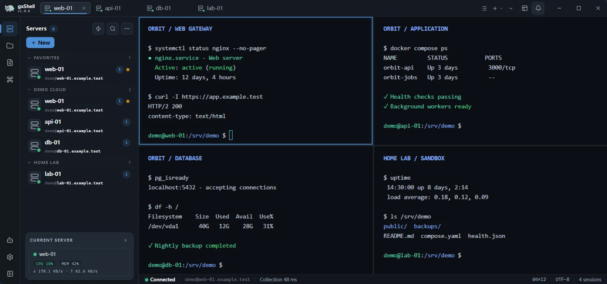
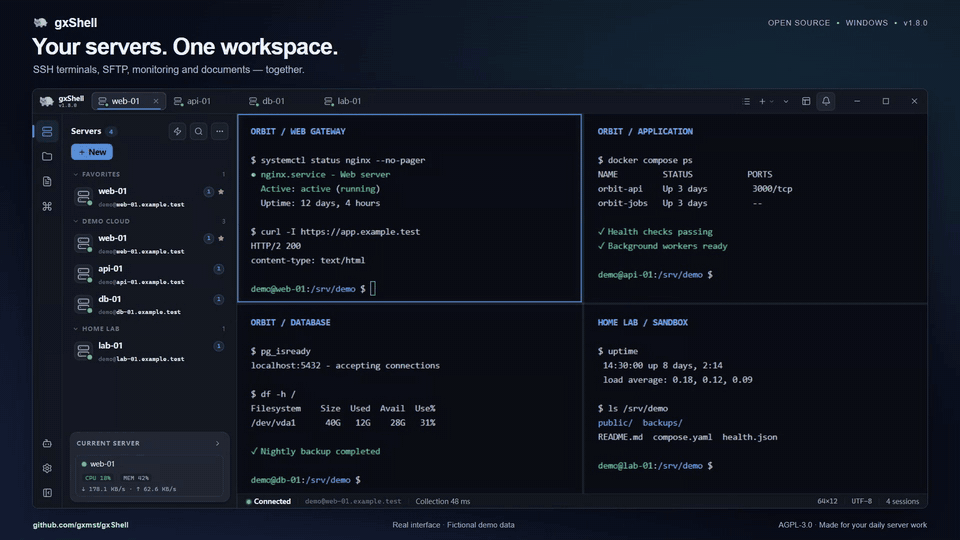
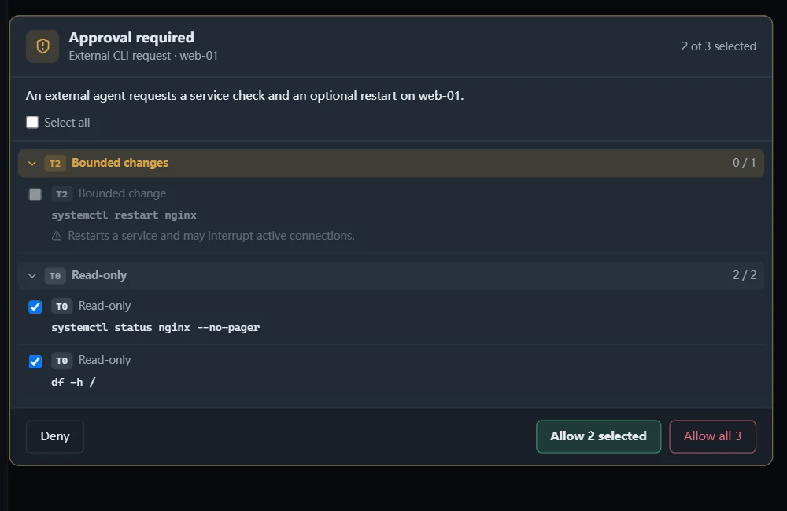
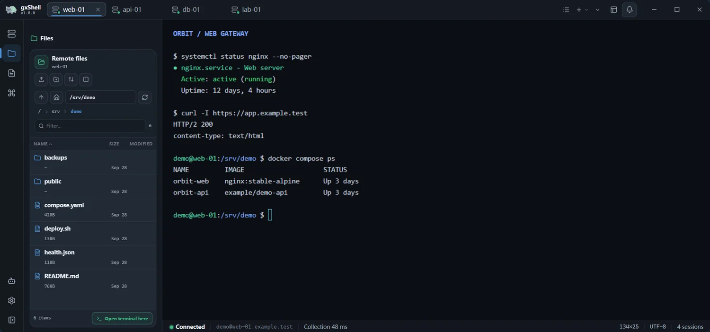
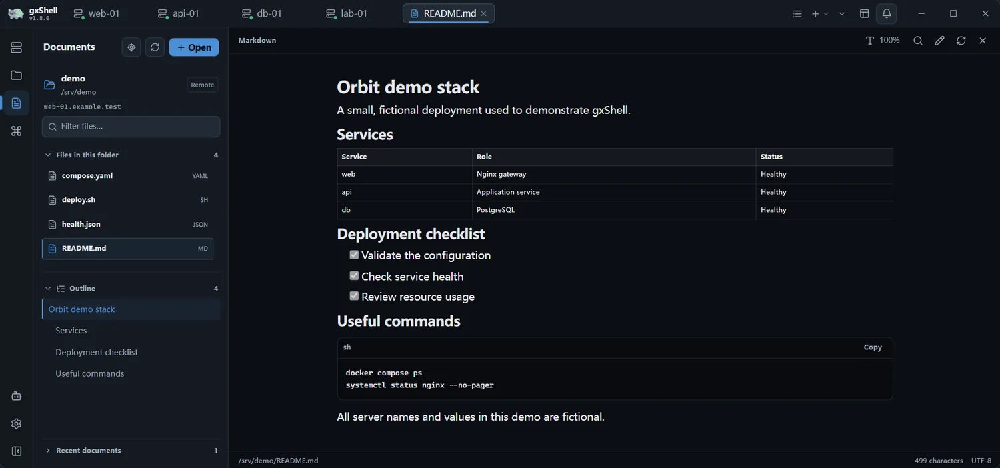
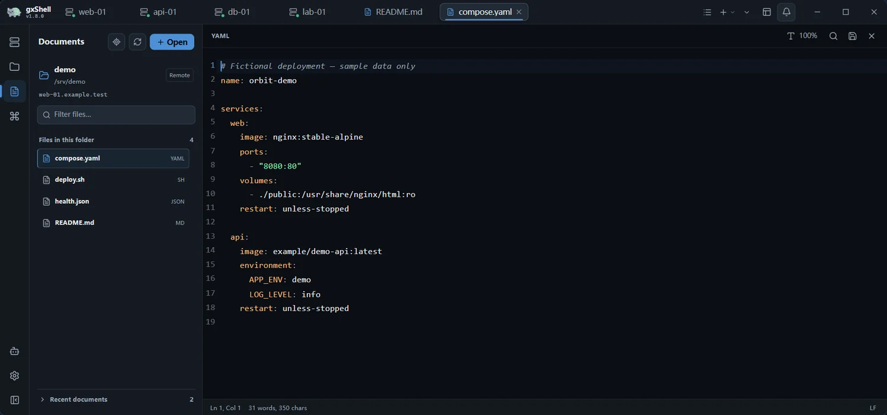

# gxShell

[](https://github.com/gxmst/gxShell/releases/latest)
[](https://github.com/gxmst/gxShell/actions/workflows/verify.yml)
[](LICENSE)


gxShell is a compact SSH workbench for Windows, built with Go, Wails, and
WebView2. It brings terminals, SFTP, monitoring, and remote file editing into
one clean desktop interface.

Use the built-in AI assistant with your own compatible model API, or let
CLI-capable tools such as Claude Code and Codex work through your existing SSH
connections. Agents address servers by alias, so you do not need to hand them
SSH passwords or private keys. Approval controls and expiring trust govern
remote operations; external CLI access is disabled by default.

[Download](#download) · [Demo](#demo) · [Agent guide](docs/agent-guide.md) · [中文说明](README.zh-CN.md)

[](docs/marketing/assets/01-workspace.png)

*The images and video below show the real interface with fictional servers,
commands, metrics, and documents. No personal server data is used.*

## Download

Download the latest [Windows x64 release](https://github.com/gxmst/gxShell/releases/latest).
The recommended zip keeps the desktop app at its root. The optional CLI,
English and Chinese usage guides, and agent-safety guide are grouped under
`CLI/`; the license and build manifest are also included. The CLI server is
disabled by default and must be explicitly enabled in Settings.

Requirements: Windows 10/11 x64 and the Microsoft WebView2 Runtime. The
unsigned build may show a SmartScreen warning on first launch; use **More
info → Run anyway** only when the checksum matches the release page.

To verify the package, compare its hash against `SHA256SUMS.txt` from the same
release:

```powershell
Get-FileHash .\gxShell-v<version>-windows-amd64.zip -Algorithm SHA256
```

## Demo

[](docs/marketing/assets/gxshell-english-demo.mp4)

**[Full 39-second demo (MP4, 1080p)](docs/marketing/assets/gxshell-english-demo.mp4)**
· [English subtitles](docs/marketing/assets/gxshell-english-demo.srt)

The short loop above previews three scenes. The full silent video follows a
server check, a remote runbook and configuration file, and an external agent
request where only the read-only checks are approved.

## Highlights

### Built-in AI and access for external agents

The in-app assistant works with terminal context and remote tools. The optional
local CLI lets external agents reuse saved connections without copying SSH
credentials into prompts or agent configuration. `secret://` references also
keep named secret values out of prompts and command arguments.

Review requested operations and approve only the items you choose. Trust can
be granted for 1, 4, 8, or 24 hours; sensitive and high-risk operations still
require confirmation. These controls reduce accidental exposure and are not
a sandbox for untrusted commands. See the [security model](docs/security.md).

[](docs/marketing/assets/03-agent-review.png)

### Files and documents alongside your terminals

Browse a remote folder, read a Markdown runbook, and edit deployment files
without leaving the workspace. Click either screenshot for the full-size view.

| SFTP and terminal | Remote runbooks |
| --- | --- |
| [](docs/marketing/assets/02-files.png) | [](docs/marketing/assets/02-documents.png) |

<details>
<summary>View the configuration editor</summary>

[](docs/marketing/assets/02-editor.png)

</details>

<details>
<summary>Full feature list</summary>

- Local CLI and HTTP API that let scripts and AI agents work on your servers through the app, with alias-only targeting, native approvals, expiring trust, and `secret://` references that keep credentials out of prompts and process arguments.
- Built-in AI assistant over any OpenAI-compatible API, with streaming replies, terminal context, and confirmation before any remote tool call.
- Multi-session SSH terminal with independent terminals for the same server, two- or four-pane layouts, named workspaces, reconnect, broadcast input, and searchable tabs.
- Per-server terminal appearance, SSH character encoding, TERM, and Backspace/Delete preferences.
- SFTP browsing, uploads, downloads, resumable transfers, and local/remote document workflows.
- Linux monitoring, Docker operations, SSH tunnels, services, firewall, cron, and website helpers over SSH.
- Local/remote document navigation and editing for Markdown, JSON/JSONC/JSONL/NDJSON, source code, and deployment files; Mermaid zoom, read-only PDF viewing, and responsive large-text previews.
- Encrypted configuration backups with import previews, conflict handling, optional credentials/private keys, and rollback on failed imports.
- Session recording to asciinema `.cast` files with a built-in player, plus opt-in text logs and automatic cleanup by age and total size.
- Windows tray integration, file associations, drag-and-drop opening, and update notifications.

</details>

## Keyboard shortcuts

| Shortcut | Action |
| --- | --- |
| `Ctrl+K` | Search servers, sessions, commands, and workspace actions |
| `Ctrl+F` | Find in the focused terminal or document |
| `Ctrl+Tab` / `Ctrl+Shift+Tab` | Next / previous tab |
| `Alt+1` … `Alt+9` | Jump to a tab |
| `Ctrl+Shift+W` | Close the active tab |
| `Ctrl+S` | Save an edited document |

## Security

- Passwords, key passphrases, and AI API keys use the OS credential store or an encrypted fallback.
- CLI access is disabled by default. When explicitly enabled, it is local-only, token-protected, opt-in per profile, and guarded by native confirmations.
- AI and CLI commands apply dangerous-command and sensitive-path policies before execution.
- The app does not send telemetry; its optional public release check is disabled by default.

Read the full [security model](docs/security.md).

## Documentation

| Topic | Document |
| --- | --- |
| Feature reference | [docs/features.md](docs/features.md) |
| Encrypted backup and migration | [docs/development/backup-migration.md](docs/development/backup-migration.md) |
| Session log retention | [docs/development/session-log-retention.md](docs/development/session-log-retention.md) |
| CLI and local API | [docs/cli.md](docs/cli.md) |
| Agent execution contract | [docs/agent-guide.md](docs/agent-guide.md) |
| Architecture notes | [docs/architecture.md](docs/architecture.md) |
| Development | [docs/development.md](docs/development.md) |
| Release process | [docs/releasing.md](docs/releasing.md) |
| Change history | [CHANGELOG.md](CHANGELOG.md) |

## Known limitations

- Windows x64 is the supported release platform. Linux and macOS desktop builds are experimental CI artifacts.
- WebView2, tray behavior, keyring integration, and file associations may differ outside supported Windows versions.
- Monitoring expects Linux-style remote hosts, and Docker management runs over SSH rather than a local Docker socket.
- ProxyJump supports one jump-host level; terminal split view supports up to four visible terminals.
- Text editing supports UTF-8 files up to 5 MiB; PDFs are read-only and limited to 50 MiB.

## License

gxShell is licensed under the [GNU Affero General Public License v3.0](LICENSE).

Commercial use is permitted. Derivative works must be released under the same
license, and if you run a modified version as a network service, its users are
entitled to that version's source. gxShell was previously licensed under
CC BY-NC-SA 4.0, which is not a software license and forbade commercial use;
releases up to and including v1.5.2 remain available under those terms.
