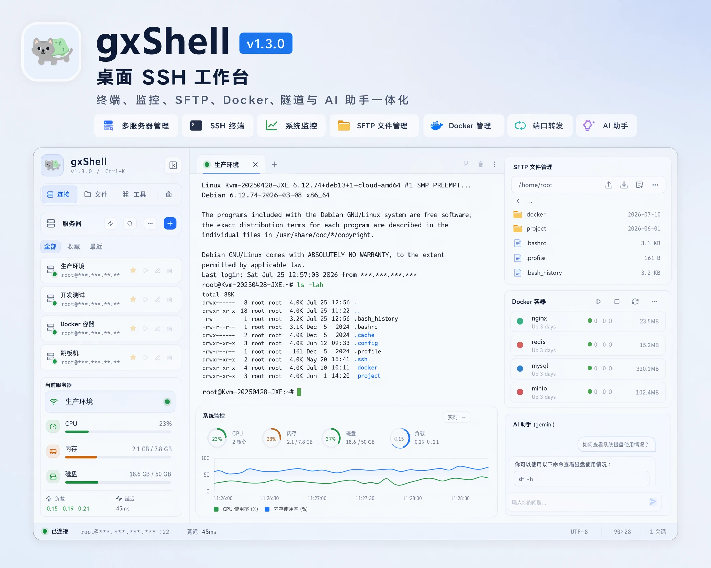

# gxShell

[](https://github.com/gxmst/gxShell/releases/latest)
[](https://github.com/gxmst/gxShell/actions/workflows/verify.yml)
[](LICENSE)


gxShell 是一个 Windows SSH 工作台，把终端会话、SFTP、监控、隧道、AI
工具、本地与远程文档查看/编辑器和可选 CLI 集成在一个桌面应用中。

与常规 SSH 客户端不同的地方：本地工具和 AI agent 可以**通过**正在运行的
gxShell 在你的服务器上执行命令，全程拿不到 SSH 凭据。它们只能用 alias 指定目标
——不给 hostname、用户名、端口和跳板机信息——超出只读范围的动作会弹出原生确认对
话框。信任可以按 1、4、8、24 小时授予，没有永久开关。

[English](README.md)



## 下载

前往 [Windows x64 最新版](https://github.com/gxmst/gxShell/releases/latest)。
推荐下载 zip；桌面应用位于压缩包根目录，可选 CLI、中英文使用说明和 Agent 安全
规范统一放在 `CLI/` 子目录，另附许可证和构建清单。CLI 服务默认关闭，必须在设置
中明确开启。

运行要求：Windows 10/11 x64，以及 Microsoft WebView2 Runtime。未签名版本
首次启动可能显示 SmartScreen 提示；只有在校验和与 Release 页面一致时，才应点
“更多信息 → 仍要运行”。

校验时，用下面的命令与同一个 Release 里的 `SHA256SUMS.txt` 比对：

```powershell
Get-FileHash .\gxShell-v<版本>-windows-amd64.zip -Algorithm SHA256
```

## 主要功能

- 本地 CLI 和 HTTP API，让脚本和 AI agent 借助本应用操作服务器：只能用 alias 指定目标、原生确认、限时信任，以及 `secret://` 引用（凭据不进入模型提示词和进程参数）。
- 内置 AI 助手，支持任意 OpenAI 兼容 API，流式回复、终端上下文，远程工具调用前必须确认。
- 多会话 SSH 终端，支持重连、搜索、分屏、浮动标签、同步广播输入和自适应标签栏。
- SFTP 浏览、上传、下载、断点续传，以及本地/远程文档工作流。
- 通过 SSH 提供 Linux 监控、Docker、隧道、服务、防火墙、Cron 和网站工具。
- Markdown 和文本查看/编辑支持代码高亮与 Mermaid；另支持本地/远程 PDF 查看，以及带语法提示、校验和格式化的 JSON/JSONL 编辑。
- 终端录制为 asciinema `.cast` 文件，内置播放器。
- Windows 托盘、文件关联、拖放打开和更新提示。

## 快捷键

| 快捷键 | 操作 |
| --- | --- |
| `Ctrl+K` | 搜索服务器、会话、命令和工作区操作 |
| `Ctrl+F` | 在终端或文档中搜索 |
| `Ctrl+Tab` / `Ctrl+Shift+Tab` | 切换前后标签 |
| `Alt+1` … `Alt+9` | 跳转到对应标签 |
| `Ctrl+Shift+W` | 关闭当前标签 |
| `Ctrl+S` | 保存已编辑文档 |

## 安全

- 密码、密钥口令和 AI API Key 使用系统凭据存储或加密回退存储。
- CLI 默认关闭；明确开启后仅监听本机，使用令牌保护，按 profile 显式启用，并受原生确认保护。
- AI 和 CLI 执行前会检查危险命令和敏感路径。
- 应用不发送遥测；可选的公开 Release 检查默认关闭。

详见[安全模型](docs/security.md)。

## 文档

| 主题 | 文档 |
| --- | --- |
| 功能说明 | [docs/features.md](docs/features.md) |
| CLI 和本地 API | [docs/cli.md](docs/cli.md) |
| Agent 执行规范 | [docs/agent-guide.md](docs/agent-guide.md) |
| 架构说明 | [docs/architecture.md](docs/architecture.md) |
| 开发 | [docs/development.md](docs/development.md) |
| 发布流程 | [docs/releasing.md](docs/releasing.md) |
| 变更记录 | [CHANGELOG.md](CHANGELOG.md) |

## 已知限制

- 正式发布支持 Windows x64；Linux 和 macOS 桌面构建仅是实验性 CI 产物。
- WebView2、托盘、系统凭据存储和文件关联在非支持版本上可能存在差异。
- 主机监控按 Linux 风格远程主机设计，Docker 工具通过 SSH 工作而不是本地 Docker Socket。
- ProxyJump 支持一层跳板机；终端分屏设计为同时显示两个终端。

## 许可证

gxShell 使用 [GNU Affero General Public License v3.0](LICENSE) 授权。

允许商业使用。衍生作品必须以相同许可证发布；如果你把修改后的版本作为网络服务运
行，服务的使用者有权获得该版本的源码。此前使用的是 CC BY-NC-SA 4.0——它不是软件
许可证，且禁止商业使用；v1.5.2 及更早的发布仍可按原条款获取。
