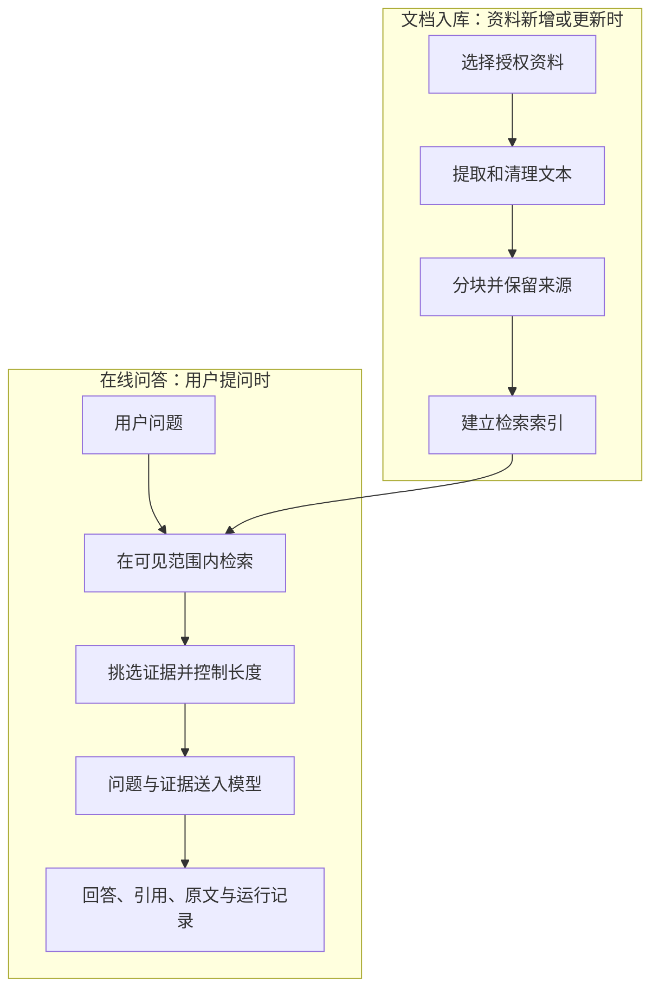

### 2.2 两条流程要分清

```mermaid
flowchart TD
    subgraph Indexing[文档入库：资料新增或更新时]
        A[选择授权资料] --> B[提取和清理文本]
        B --> C[分块并保留来源]
        C --> D[建立检索索引]
    end
    subgraph Answering[在线问答：用户提问时]
        E[用户问题] --> F[在可见范围内检索]
        D --> F
        F --> G[挑选证据并控制长度]
        G --> H[问题与证据送入模型]
        H --> I[回答、引用、原文与运行记录]
    end
```
